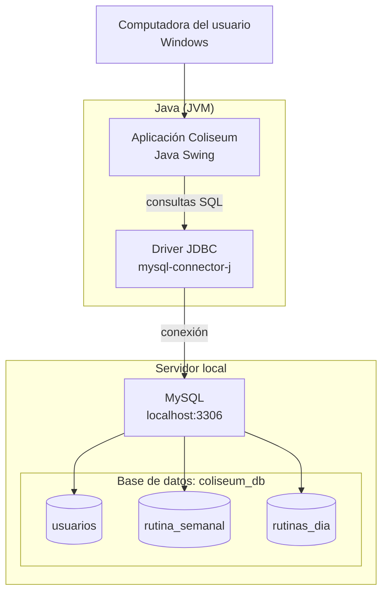
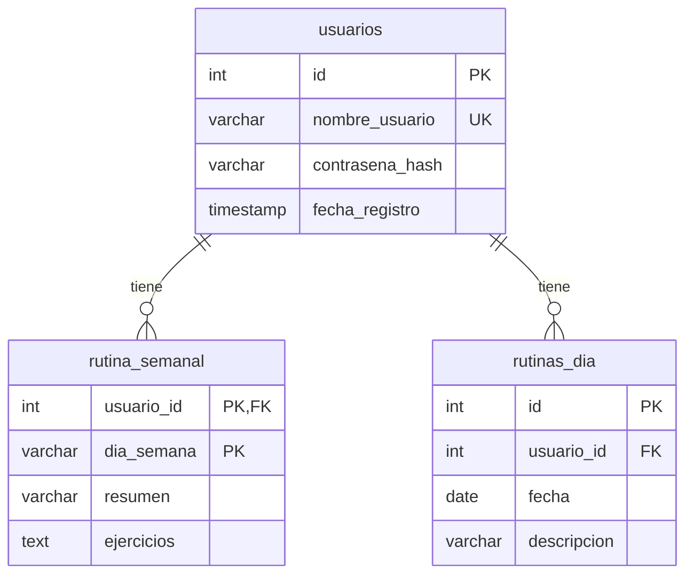

# Infraestructura - Coliseum

## Diagrama

## Modelo de datos

| Tabla | Para qué sirve |
|-------|----------------|
| `usuarios` | Usuario (único) y contraseña cifrada con SHA-256 |
| `rutina_semanal` | Resumen y ejercicios de cada día de la semana |
| `rutinas_dia` | Rutinas de una fecha concreta del calendario |

Si se borra un usuario, se borran también sus rutinas (`ON DELETE CASCADE`).

## Requisitos para ejecutarlo

1. Tener instalado Java (JDK).
2. Tener MySQL corriendo en el puerto 3306.
3. Ejecutar el script `Coliseo_Workbench.sql` en MySQL Workbench para crear la base `coliseum_db` y las tablas.
4. Tener `mysql-connector-j` en el classpath.
