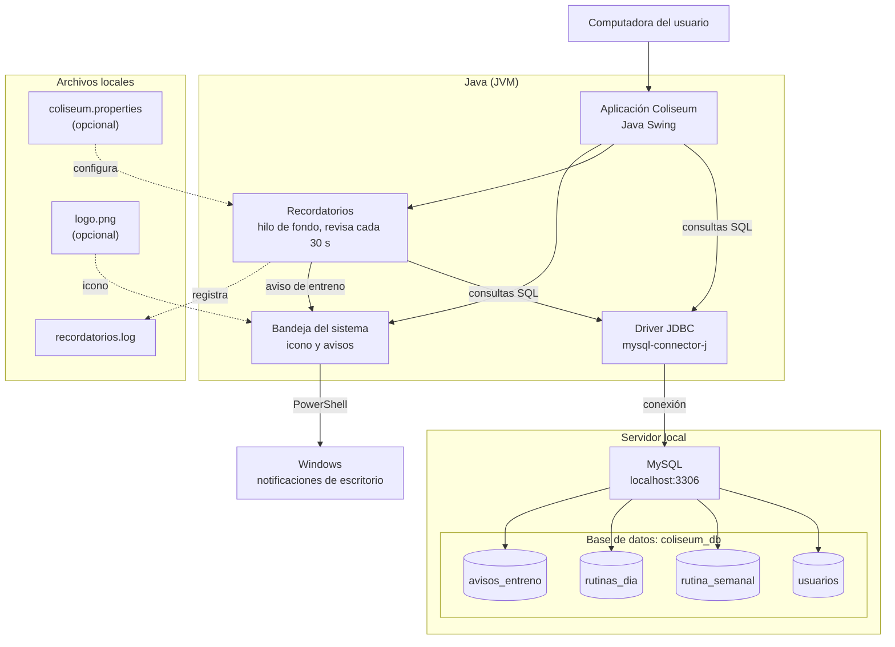
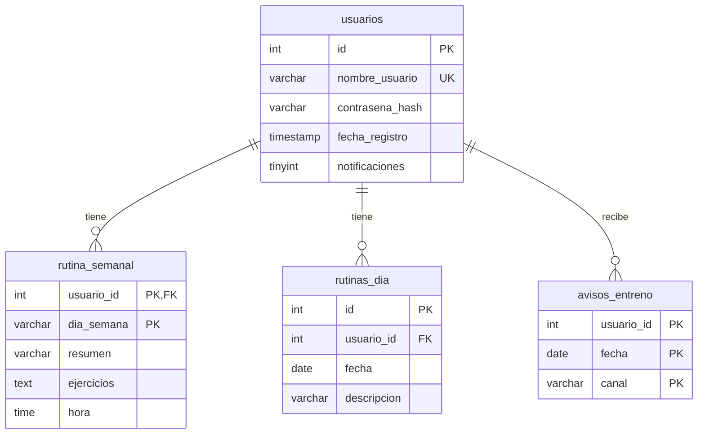

# Infraestructura - Coliseum

## Diagrama

## Modelo de datos

| Tabla | Para qué sirve |
|-------|----------------|
| `usuarios` | Usuario (único), contraseña cifrada con SHA-256 y preferencia de notificaciones (sin elegir, activadas o desactivadas) |
| `rutina_semanal` | Resumen, ejercicios y hora de inicio de cada día de la semana |
| `rutinas_dia` | Rutinas de una fecha concreta del calendario |
| `avisos_entreno` | Registro de los avisos de entreno ya enviados, para no repetirlos (se limpian los de más de 7 días) |

Si se borra un usuario, se borran también sus rutinas (`ON DELETE CASCADE`). La tabla `avisos_entreno` no tiene clave foránea, así que sus registros no se borran en cascada.

La columna `notificaciones`, la columna `hora` y la tabla `avisos_entreno` no están en el script de Workbench: la aplicación las crea sola al arrancar si faltan.

## Requisitos para ejecutarlo

1. Tener instalado Java (JDK 11 o superior).
2. Tener MySQL corriendo en el puerto 3306.
3. Ejecutar el script `Coliseo_Workbench.sql` en MySQL Workbench para crear la base `coliseum_db` y las tablas.
4. Tener `mysql-connector-j` en el classpath.
5. Para las notificaciones de escritorio: un sistema con bandeja del sistema (recomendado Windows, con PowerShell y las notificaciones activadas en Configuración > Sistema > Notificaciones).
6. Opcional: `logo.png` junto al programa (icono de la ventana, la barra de tareas y la bandeja).
7. Opcional: `coliseum.properties` junto al programa para cambiar los avisos. Si no existe, se usan los valores por defecto.

| Propiedad | Por defecto | Para qué sirve |
|-----------|-------------|----------------|
| `recordatorio.hora_por_defecto` | `18:00` | Hora de entreno de los días que no tienen hora propia |
| `recordatorio.minutos_antes` | `20` | Minutos de anticipación del aviso |
| `recordatorio.ventana_minutos` | `30` | Tiempo de tolerancia para avisar si la app estaba cerrada |

## Modos de ejecución

| Comando | Qué hace |
|---------|----------|
| `java Coliseum` | Abre la aplicación con login. Si ya hay una instancia abierta, la trae al frente |
| `java Coliseum --recordatorios` | Servicio de avisos sin ventana para todos los usuarios |
| `java Coliseum --simular "2026-09-30 18:00"` | Muestra a quién se avisaría a esa fecha y hora, sin enviar nada |
| `java -Dcoliseum.gpu=true Coliseum` | Reactiva la aceleración gráfica por GPU (desactivada por defecto) |
| `java -Dcoliseum.puerto=NNNNN Coliseum` | Fuerza el puerto local usado para la instancia única |

## Archivos que genera

| Archivo | Para qué sirve |
|---------|----------------|
| `recordatorios.log` | Registro de avisos enviados, reintentos, diagnósticos y errores |
| `coliseum-recordatorios.lock` (carpeta temporal del sistema) | Evita que haya dos servicios de avisos a la vez |